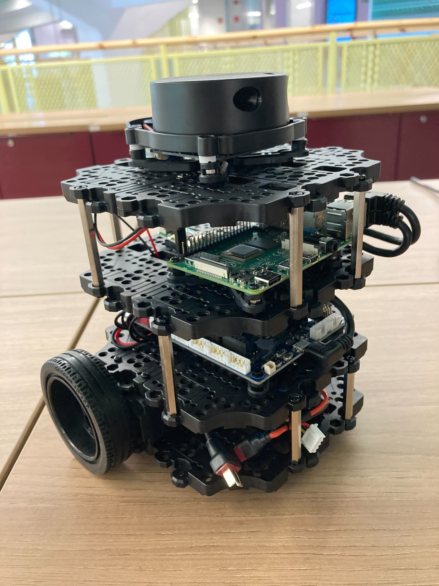
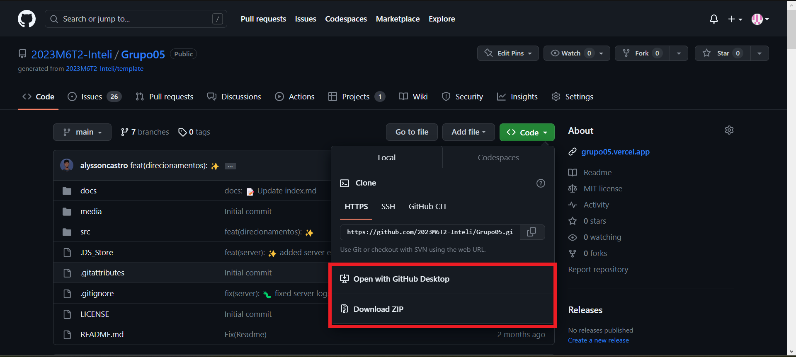
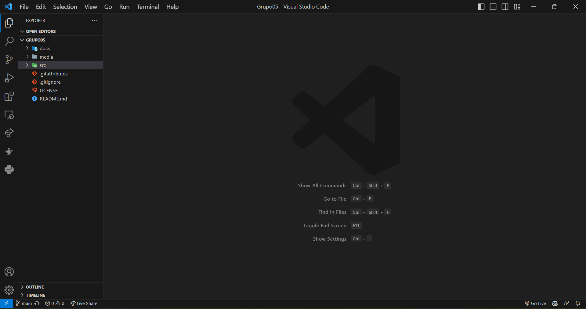
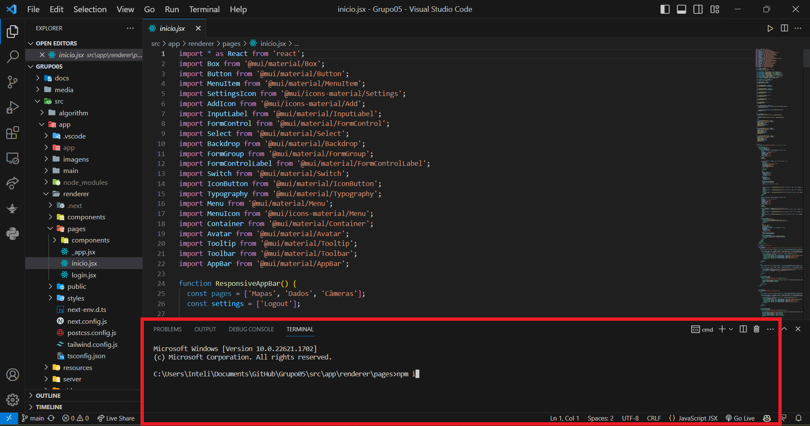
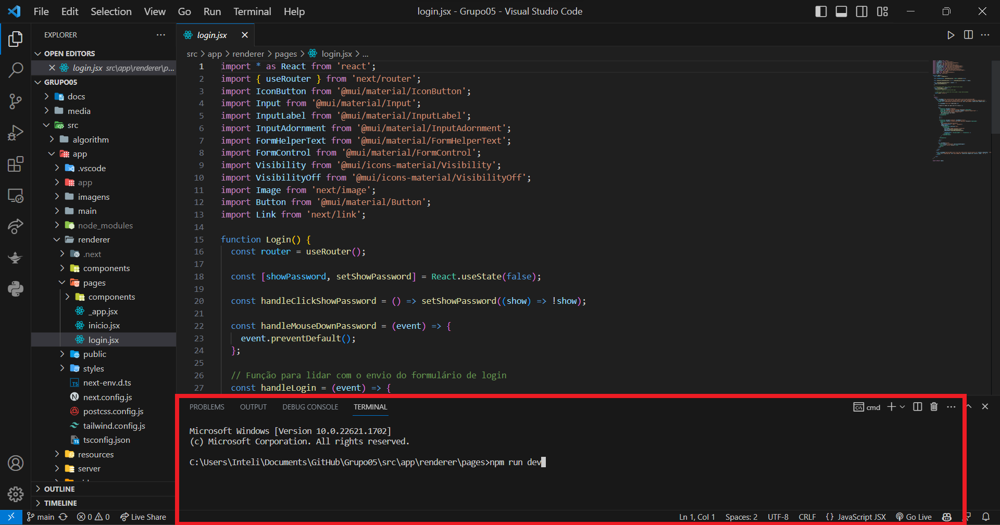
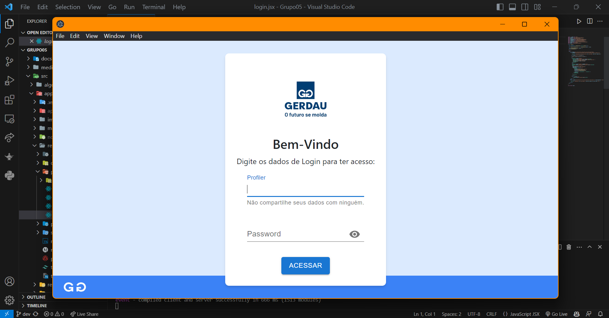

<table>

<tr>
<td>
<a  href= "https://www2.gerdau.com.br/"></a>
</td>
<td><a  href= "https://www.inteli.edu.br/"></a>
</td>
</tr>

</table>

# Simulações de Robôs para aplicações diversas

## Ger_bROS

## Integrantes:
<a  href="https://www.linkedin.com/in/alysson-cordeiro-0684a8236">Alysson Cordeiro</a><br>
<a  href="https://www.linkedin.com/in/brunomleao">Bruno Leão</a><br>
<a  href="https://www.linkedin.com/in/caio-m1849">Caio Martins</a><br>
<a  href="https://www.linkedin.com/in/filipi-enzo-siqueira-kikuchi-1811a9213">Filipi Kikuchi</a><br>
<a  href="https://www.linkedin.com/in/kil-matheus-gomes-teixeira-78257020a">Kil Matheus</a><br>
<a  href="https://www.linkedin.com/in/paulo-evangelista">Paulo Evangelista</a><br>
<a  href="https://www.linkedin.com/in/kil-matheus-gomes-teixeira-78257020a">Henrique Schilder</a><br>

---

## Descrição
O Instituto de Tecnologia e Liderança (INTELI) estabeleceu uma parceria com a GERDAU, uma das maiores empresas produtoras de aço, com o objetivo de criar uma solução tecnológica inovadora. Essa colaboração envolveu alunos do curso de Engenharia da Computação, que desenvolveram um sistema capaz de analisar as condições atmosféricas de forma precisa utilizando dispositivos de Internet das Coisas (IoT) e um robô capaz de se locomover em espaços confinados.
O principal objetivo dessa solução é ajudar a GERDAU a alcançar um desafio importante, o "Acidente Zero". Com esse projeto, a empresa busca reduzir os riscos aos quais seus colaboradores são expostos em ambientes confinados, oferecendo uma análise prévia do local. Isso proporcionará um controle mais efetivo da situação e uma tomada de decisão mais precisa.
Para viabilizar o desenvolvimento dessa solução, o INTELI disponibilizou robôs móveis fabricados pela empresa Robotis. Esses robôs serão integrados com lógica de programação para movimentação, sensores e um Dashboard, agregando um valor significativo para o nosso cliente.

<br><br>

<p  align="center">


<i>Imagem 1: robô</i>

</p>

<p  align="center">
Fonte: TurtleBot3 Robotis, Disponibilizado pelo Inteli.

</p>O nosso projeto tem como objetivo principal auxiliar os colaboradores da GERDAU a terem um controle mais efetivo em situações em que é necessário que um ser humano adentre um espaço confinado para realizar uma manutenção. O objetivo é reduzir significativamente a probabilidade de exposição a riscos, especialmente os relacionados às condições atmosféricas.
O nosso robô será equipado com sensores avançados, capazes de detectar as condições atmosféricas presentes no ambiente, incluindo o nível de oxigênio e a presença de gases tóxicos e/ou inflamáveis. Além disso, o robô será capaz de capturar imagens do local utilizando uma câmera integrada, permitindo uma análise visual precisa. Todas essas informações serão transmitidas para uma plataforma de interface intuitiva, onde o técnico terá acesso às informações coletadas antes de tomar qualquer decisão.
Com essa solução, visamos proporcionar uma avaliação prévia do ambiente confinado, permitindo que o técnico tenha acesso a informações essenciais para tomar decisões seguras e bem informadas. Dessa forma, aumentaremos a segurança e reduziremos os riscos associados às atividades em espaços confinados.

<br>

---

## 🛠 Estrutura de pastas

```bash
.
├──  LICENSE
├──  README.md
├──  docs
│  ├──  README.md
│  ├──  _config.yml
│  ├──  index.md
│  ├──  img
│  └──  pdf
├──  media
│  └──  README.md
└──  src
├──  README.md
├──  algorithm
│  ├──  battery.py
│  ├──  initial.py
│  ├──  map_generator.py
│  └──  simulation.py
├──  app
│  ├──  pages
│  ├──  components
│  ├──  styles
│  ├──  utils
│  ├──  api
│  └──  ...  outros  arquivos  e  pastas  relevantes  para  o  projeto  Next.js
├──  embed
│  └──  ROS_pkgs
│  └──  ...outros  arquivos  e  pastas  relevantes  para  o  pacote  ROS
└──  img_detection
├──  model.pt
└──  pipeline.ipynb
12  directories,  18  files

```

Todas as nossa pastas importantes estão declaradas acima. Vale ressaltar que quando utilizamos algumas tecnologias de desenvolvimento como Backend, Frontend e Bibliotecas para o funcionamento da solução como todo, elas geram inúmeros diretórios que não cabem a serem declarados 
acima, pois é de uso e funcionamento interno do sistema.

---
## 💻 **MANUAL DE CONFIGURAÇÃO E DE INSTALAÇÃO DO USUÁRIO**.
<br></br>

Este manual serve para orientação de aprendizagem e executação da aplicação, a fim de facilitar a usabilidade do usuário
### **Como usar o programa?**
Inicialmente para podermos utilizar a nossa aplicação, devemos primeiramente baixar os diretórios diretamente do GitHub no link a seguir:
* Diretório - https://github.com/2023M6T2-Inteli/Grupo05
Para fazer o download do repositório, deve-se seguir conforme a imagem abaixo:


<i>Imagem 2: diretório</i>
<br></br>

Vale ressaltar que você poderá baixar de duas maneiras:
1. Através do *Open with GitHub Desktop*. Por aqui poderá crar um clone para sua máquina.
2. Ou através do *Download ZIP*.
Em seguida, abra seu editor de código - usamos o Visual Code para execução. E vá para a pasta destino do programa.
**Pasta destino: src>app>renderer>pages>inicio**


<i>Imagem 3: VS Code aberto</i>
<br></br>

Agora, nessa pasta, baixe o framework React.js. Aqui está comando para baixar o React usando o npm:
<b>npm install react</b>
E também o Next.js. Aqui estão os comandos para baixar o Next.js usando o npm:
<b>npm install next</b>

Logo depois, instale as bibliotecas pedentes. aqui estão as bibliotecas Utilizadas:
* MUI, Material UI - https://mui.com
* MUI, Icons Material - https://mui.com/material-ui/getting-started/installation/
* React-Boostrap - https://react-bootstrap.github.io/docs/getting-started/introduction
* Axios - https://axios-http.com/docs/intro
* Tailwindcss - https://tailwindcss.com/docs/installation

  Todas as bibliotecas utilizadas a seguir, desde de que o projeto esteja baixado direto do Github e esteja aberto no terminal do VSCode, podem ser instaladas pelo comando:
<b>npm i</b>

Caso ainda não consiga instalar tudo, você pode instalar separadamente utilizando os comandos <b>npm install</b> e suas respectivas bibliotecas ou visitando os sites indicados de cada uma acima.


<i>Imagem 4: instalação das bibliotecas</i>
<br></br>

Agora com nosso ambiente configurado, você já pode executar o programa usando "<b>npm run dev</b>". Lembre-se que, para executá-lo, você precisa estar na pasta destino do código principal que é "**pages**". Aqui está o direcionamento: **src>app>renderer>pages>inicio**.


<i>Imagem 5: aplicação rodando.</i>
<br></br>

Prontinho! O front-end está funcionando em sua máquina!


<i>Imagem 6: aplicação rodando</i>

## LISTA DE COMPONENTES DO SISTEMA:

| Item             | Descrição                  |
|------------------|----------------------------|
| 1. Robô TurtleBot3   | Um robô programável usado em aplicações de robótica educacional e pesquisa.    |
| 2. DashBoard     | Uma interface gráfica que exibe informações e controles para um sistema específico. |
| 3. Câmera         | Um dispositivo que captura imagens ou vídeos.                                 |
| 4. Sensor de gás | Um sensor que detecta a presença e concentração de gases no ambiente.           |
| 5. MQ-135        | Um tipo específico de sensor de gás utilizado para detectar substâncias como amônia, óxido nítrico, dióxido de enxofre, etc. |


## Robô

Após o Robô já estiver montado, o mesmo necessita de um sistema operacional que administre os seus recursos disponíveis para possa ler, processar e rodar os comandos enviados pela rede.

O link do repositório abaixo é um tutorial feito pelo Professor de Programação Rodrigo Mangoni Nicola, na qual explica passo a passo como é feita essa configuração de um microSD antes de ele ser plugado no próprio Robô.
Ainda no mesmo link, é necessário fazer uma configuração específica no Sistema Operacional (uma distribuição do Linux), para que ele consiga acessar uma rede específica por exemplo.

[https://github.com/rmnicola/m6-ec-encontro7](https://github.com/rmnicola/m6-ec-encontro7)

O Sistema Operacional pronto no microSD é uma base para que o Robô possar interpretar informações. Para que a nossa solução funcione, é necessário fazer o Download do nosso repositório dentro do microSD; há duas maneiras de fazer esse clone.

* 1°: Plugar o MicroSD no computador e baixar os arquivos de maneira manual.
* 2°: Conectar em um televisor, um cabo HDMI na qual sai do Robô, e utilizar o Git para clonar o Repositório.

Após o repositório clonado, é necessário fazer a instalação do ROS2 dentro do sistema operacional. Essa configuração já está disponibilizado no mesmo link dito anteriormente.

Dentro do diretório correspondente ao projeto, no caminho <b>./Grupo05/src/embed/ROS_pkgs</b> temos os pacotes pertencentes ao ROS2. Ainda dentro desse diretório, existe uma pasta chamada <b>GERBROS</b> na qual é responsável pela comunicação e controle do Robô e outro pasta chamada <b>interfaces</b> na qual possui a interface de mensageria que defini os tipos de mensagens e serviços que serão utilizados pelo pacote <b>GERBROS</b> para funcionar.

Pacotes ROS- `interfaces`: Pacote C++ que contém as interfaces (tipagens das mensagens e serviços) ROS  
- `gerbros`: Pacote Python que contém todos os nós ROS### Instalando o pacote:  
Na pasta ROS_pkgs, execute `colcon build --packages-up-to gerbros interfaces --symlink-install` para buildar os pacotesinstale-os com `source install/setup.sh` (`setup.zsh` caso use ZSH)### rodando os pacotes  
Para executar todos os nós ROS, rode `ros2 launch gerbros launch.xml`> Para deixar o terminal do ROS mais legível, execute: `export RCUTILS_CONSOLE_OUTPUT_FORMAT="[{severity} | {name}]> {message}"`

Após seguir esse passos, o Robô está pronto.
___

  ## 🐛Troubleshooting

Troubleshooting é um processo usado para identificar e resolver problemas em sistemas, dispositivos eletrônicos, redes ou qualquer outra coisa que possa apresentar um mau funcionamento ou falha. O objetivo do troubleshooting é isolar a causa raiz do problema e implementar uma solução adequada para restaurar o funcionamento normal do sistema ou dispositivo.

| Situação                                 | Solução                                                                                                                                                       |
| ---------------------------------------- | ------------------------------------------------------------------------------------------------------------------------------------------------------------- |
| O Robô não liga                   | Verificar se o cabo de alimentação da bateria está corretamente conectado ao sistema do Robô. Verifique se a bateria contem energia suficiente para ligar o Robô. Verifique se a chave geral de energia do Robô está ligada.|
| Front-end não está encontrando o Robô      | Verificar se existe algum problema de rede. Verificar a conexão com fio ou conexão sem fio. Verificar se a aplicação está conectada na mesma rede que o Robô|
| O Robô não responde a nenhum comando		| Reinicie o Robô. Verifique se o Robô está na mesma rede da aplicação. Verifique se o a conexão é estável e segura. Verifique se o Front está conectando ao Robô.

---

## 🗃 Histórico de lançamentos
A cada atualização os detalhes devem ser lançados aqui.
*  <b>1° Sprint</b>:

17/04/2023 ~ 28/04/2023

-Desenvolvimento (Criação da versão 1.0 da Arquitetura da Solução Robô, Front e Back, Criação da versão 1.0 do Mockup do Front-End, Instalações dos Ambientes de Desenvolvimento, Documentação).
*  <b>2° Sprint</b>:

01/05/2023 ~ 12/05/2023

-Desenvolvimento (Desenvolvimento Inicial do Back-End, Desenvolvimento Inicial das Rotas, Desenvolvimento Inicial do Front-End v1.0).

-Atualização/Revisão (Versão 2.0 da Arquitetura do Sistema, Versão 2.0 do Front-End, Atualização de Documentação).* <b>3° Sprint</b>:
*  <b>3° Sprint</b>:

15/05/2023 ~ 26/05/2023

-Desenvolvimento (Desenvolvimento do Front v2.0, Desenvolvimento das Rotas Back/Robô, 1° Interação do o Turtlebot3, Desenvolvimento para Detecção dos Sensores.)

-Atualização/Revisão (Documentação)
*  <b>4° Sprint</b>:

29/05/2023 ~ 07/06/2023

-Desenvolvimento (Integrações Front, Back e Robô, Teste das Rotas do Back-End)- Atualização/Revisão (Revisão da Arquitetura da Solução v2.0, Documentação, Manual da Solução)
*  <b>5° Sprint</b>:

12/06/2023 ~ 23/06/2023

-Desenvolvimento (Integração Front, Back e Robô)

-Atualização/Revisão (Manual da Solução, Documentação)

## Atualizações Previstas

Na página inicial, uma feature prevista é possibilidade de conseguir interagir com a tela de mapeamento, na qual será possível marcar quais serão os pontos por onde o robô deve passar, pontos de partidas e de chegadas. Esse valores marcados seriam retornados para o Back-end que enviariam para o Robô, visando o mesmo ter a capacidade de locomover no espaço programado. Outra feature futura está relacionada na finalização da função de configuração, o usuário poderá escolher o tema de fundo e tambem conseguir fazer os ajuste como desejar.
O mapa de calor estava previsto para desenvolvimento, entretanto após um revisão e revalidação com o cliente, essa feature deixo de ser prioritária.
Média Móvel é a análise obtidas dos sensores, e dela retirar uma média que seria retornado no relatório (Robô).
Geração de relatórios, o usuário conseguirá fazer o download das informações após a análise do Robô.
Banco de Dados para a Nuvem utilizando o SupaBase, Atualmente está sendo utilizado o SQLite afins de teste, mas futuramente será possível guardar as informações em um banco na rede.

  
## 📋 Licença/License

<p xmlns:cc="http://creativecommons.org/ns#" xmlns:dct="http://purl.org/dc/terms/"> This project is licensed under <a href="http://creativecommons.org/licenses/by/4.0/?ref=chooser-v1" target="_blank" rel="license noopener noreferrer" style="display:inline-block;">Attribution 4.0 International</a></p>

## 🎓 Referências
Aqui estão as referências usadas no projeto.
1. <https://github.com/iuricode/readme-template>
2. <https://github.com/gabrieldejesus/readme-model>
3. <https://creativecommons.org/share-your-work/>
