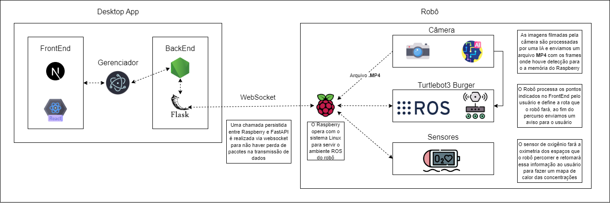

<table>

<tr>

<td>

</td>

<td>

</td>

</tr>

</table>

---

---

SIMULAÇÃO DE ROBÔS PARA APLICAÇÃO DIVERSAS.

---

---

>  _Observação 1: A estrutura inicial deste documento é só um exemplo. O seu grupo deverá alterar esta estrutura de acordo com o que está sendo solicitado nos artefatos._

>  _Observação 2: O índice abaixo não precisa ser editado se você utilizar o Visual Studio Code com a extensão **Markdown All in One**. Essa extensão atualiza o índice automaticamente quando o arquivo é salvo._

**Conteúdo**

- [Autores](#autores)

  

- [Visão Geral do Projeto](#visão-geral-do-projeto)

  

- [Empresa](#empresa)

  

- [O Problema](#o-problema)

  

- [Objetivos](#objetivos)

  

- [Objetivos gerais](#objetivos-gerais)

  

- [Objetivos específicos](#objetivos-específicos)

  

- [Partes interessadas](#partes-interessadas)

  

- [Análise do Problema](#análise-do-problema)

  

- [Análise da área de atuação](#análise-da-área-de-atuação)

  

- [Matriz de Oceano Azul](#matriz-de-oceano-azul)

  

- [**Eliminar**](#eliminar)

  

- [**Reduzir**](#reduzir)

  

- [**Criar**](#criar)

  

- [**Elevar**](#elevar)

  

- [**Avaliação de valor**](#avaliação-de-valor)

  

- [Análise do cenário: Matriz SWOT](#análise-do-cenário-matriz-swot)

  

- [Proposta de Valor: Value Proposition Canvas](#proposta-de-valor-value-proposition-canvas)

  

- [Matriz de Risco](#matriz-de-risco)

  

- [Análise Financeira](#análise-financeira)

  

- [Análise de custo do processo atual](#análise-de-custo-do-processo-atual)

  

- [Análise de custo da solução](#análise-de-custo-da-solução)

  

- [ROI - Return Over Investment](#roi---return-over-investment)

  

- [Requisitos do Sistema](#requisitos-do-sistema)

  

- [Personas](#personas)

  

- [Jornada do Usuário](#jornada-do-usuário)

  

- [Histórias dos usuários (user stories)](#histórias-dos-usuários-user-stories)

  

- [Arquitetura do Sistema](#arquitetura-do-sistema)

- - [Versão 1.0](#versão-1.0)

- - [Versão 2.0](#versão-2.0)

- [**Interface do Usuário**](#interface-do-usuário)

- [**Backend**](#backend)

- [**Sistema Embarcado**](#sistema-embarcado)

- [Controle da Plataforma Robótica](#controle-da-plataforma-robótica)

- [Algoritmo de otimização de Rota](#algoritmo-de-otimização-de-rota)

- [Arquitetura do Sistema de Simulação](#arquitetura-do-sistema-de-simulação)

- [Módulo de Visão Computacional](#módulo-de-visão-computacional)

- - [Rede Neural YOLO para Detecção de Objetos](#rede-neural-yolo-para-detecção-de-objetos)

- - [Integração de uma Câmera ao Robô Turtlebot3](#integração-de-uma-câmera-ao-robô-turtlebot3)

- - [Gravação de Vídeo com Detecção de Rachaduras](#gravação-de-vídeo-com-detecção-de-rachaduras)

- - [Eficiência e Benefícios](#eficiência-e-benefícios)

  - [Sistemas de segurança](#sistemas-de-segurança)

    - [Implementação do sistema anticolisão](#implementação-do-sistema-anticolisão)
    - [Dispositivos de segurança](#dispositivos-de-segurança)
    - [Implementação do sistema de proteção contra comandos indesejados](#implementação-do-sistema-de-proteção-contra-comandos-indesejados)
    - [Validação da eficácia dos sistemas de segurança](#validação-da-eficácia-dos-sistemas-de-segurança)

- [Integração](#integração)

- [Módulos do Sistema e Visão Geral (Big Picture)](#módulos-do-sistema-e-visão-geral-big-picture)

- [Análise de Requisitos](#análise-de-requisitos)

- [Requisitos de Software](#requisitos-de-software)

- [Requisitos Físicos](#requisitos-físicos)

- [Viabilidade Técnica](#viabilidade-técnica)

- [Diagrama de Implementação do Sistema](#diagrama-de-implementação-do-sistema)

- [Tecnologias Utilizadas](#tecnologias-utilizadas)

- [METADESIGN.](#metadesign)

  

- [FATORES MERCADOLÓGICO:](#fatores-mercadológico)

  

- [**CENÁRIO DO MERCADO.**](#cenário-do-mercado)

  

- [**VISÃO.**](#visão)

  

- [SISTEMA PRODUTO/DESIGN:](#sistema-produtodesign)

  

- [**MISSÃO.**](#missão)

  

- [**DESIGN.**](#design)

  

- [SUSTENTABILIDADE AMBIENTAL:](#sustentabilidade-ambiental)

  

- [_Referências:_](#referências)

  

- [Wireframe + Storyboard](#wireframe--storyboard)

  

- [Design de Interface - Guia de Estilos](#design-de-interface---guia-de-estilos)

  

- [Projeto de Banco de Dados](#projeto-de-banco-de-dados)

  

- [Modelo Conceitual](#modelo-conceitual)

  

- [Modelo Lógico](#modelo-lógico)

  

- [Teste de Software](#teste-de-software)

  

- [Testes Unitários](#testes-unitários)

  

- [Teste de Usabilidade](#teste-de-usabilidade)

  

- [Análise de Dados](#análise-de-dados)

  

- [Manuais](#manuais)

  

- [Manual de Implantação](#manual-de-implantação)

  

- [Manual do Usuário](#manual-do-usuário)

  

- [Manual do Administrador](#manual-do-administrador)

  

- [Referências](#referências-1)

# Autores

<a  href="https://www.linkedin.com/in/alysson-cordeiro-0684a8236">Alysson Cordeiro</a> 

<a  href="https://www.linkedin.com/in/brunomleao">Bruno Leão</a> 

<a  href="https://www.linkedin.com/in/caio-m1849">Caio Martins</a> 

<a  href="https://www.linkedin.com/in/filipi-enzo-siqueira-kikuchi-1811a9213">Filipi Kikuchi</a> 

<a  href="https://www.linkedin.com/in/kil-matheus-gomes-teixeira-78257020a">Kil Matheus</a> 

<a  href="https://www.linkedin.com/in/paulo-evangelista">Paulo Evangelista</a> 

<a  href="https://www.linkedin.com/in/kil-matheus-gomes-teixeira-78257020a">Henrique Schilder</a> 

# Visão Geral do Projeto

## Empresa

Presente em mais de 10 países, a GERDAU é a maior empresa Brasileira produtora de aço e uma das principais fornecedoras de aços longos nas Américas e de aços especiais no mundo. No Brasil, tambem produz aços planos e minério de ferro. É uma pioneira nesse setor e na implantação de iniciativas de inovação digital, além de ser uma das maiores recicladoras da América Latina, reciclando milhões de toneladas de sucato em aço, reforçando seu compromisso com o desenvolvimento sustentável das regiões onde atua.

## O Problema

Um dos valores que a GERDAU mais preza é a segurança e a construção de um ambiente seguro em suas operações. Isso ligado a um grande desafio: acidente zero.

Um dos seus maiores riscos críticos já mapeados está relacionado a operações de colaboradores em Espaços Confinados, locais onde não foram projetados para ocupação humana contínua. Esses lugares podem apresentar um risco a integridade e a saúde dos mesmos sem a capacitação e equipamento adequados como exigem as normas regulamentadoras (NR33). Além disso, espaços confinados apresentam meios limitados de entrada e saída, uma ventilação insuficiente para remover contaminantes e tambem podendo contem uma deficiência (< 19,5%) ou enriquecimento (< 23%) de oxigênio.

## Objetivos

### Objetivos gerais

Por meio de uma solução de simulação, um robô seja capaz de se mover em ambientes de espaço confinado, coletar dados a partir de sensores (principalmente de oxigênio outros gases) e que utilize filmagens para apoiar na inspeção prévia da estrutura.

### Objetivos específicos

Os objetivos específicos que a GERDAU espera da solução criada é a diminuição da probabilidade do risco de acidente durante serviços em espaços confinados por meio de uma análise atmosférica.

## Partes interessadas

Empresa GERDAU

Alunos do grupo 5 GER-bROS - Instituto de Tecnologia e Liderança - INTELI

# Análise do Problema

A Gerdau é uma das maiores produtoras de aço no Brasil, com presença em diversos países ao redor do mundo. A empresa possui uma cultura organizacional baseada no princípio de "Segurança em Primeiro Lugar", que norteia a construção de ambientes seguros para as operações e tem como objetivo alcançar o "Acidente Zero".

A empresa tem uma preocupação especial em relação aos Espaços Confinados, locais que apresentam riscos significativos à saúde e à segurança dos trabalhadores. Para mitigar esses riscos, as operações nesses espaços seguem normas de segurança rigorosas, como a NR-33. Além disso, verificações periódicas e rotinas de inspeção são realizadas externamente aos ambientes, e o acesso a eles é planejado e monitorado.

A utilização de robôs pode ser uma solução eficaz para mitigar os riscos associados aos Espaços Confinados. O robô proposto pela Gerdau seria capaz de se mover em ambientes confinados, coletar dados da atmosfera e realizar inspeções prévias da estrutura, minimizando o risco de acidentes.

Como ideia norteadora da Gerdau, a adoção do princípio de "Segurança em Primeiro Lugar" é fundamental para a construção de ambientes seguros para operações "Acidente Zero". Embora essa abordagem seja de uso interno e possa não gerar retornos financeiros diretos, sua implementação é viável e resulta em índices de segurança mais elevados, o que é fundamental para preservar a saúde e a integridade física dos trabalhadores e para garantir a continuidade das operações empresariais de forma sustentável.

## Análise da área de atuação

No contexto do projeto, a área de atuação seria a de segurança no âmbito industrial e todos os processos que envolvem atividades em Espaços Confinados. Para tanto, houve uma necessidade do entendimento das tecnologias utilizadas para suprir as necessidades dessa área. Dessa forma, chegou-se na conjuntura de AGVs.

Os AGVs, ou Automatic Guided Vehicles, são veículos guiados automaticamente que são utilizados para transportar materiais em uma variedade de ambientes industriais. Esses veículos são equipados com sensores, sistemas de controle e computadores para navegar em um ambiente sem a necessidade de um motorista humano. Eles são usados em diversas indústrias, incluindo logística, manufatura, automotiva e farmacêutica.

Os AGVs estão se tornando cada vez mais populares devido aos benefícios que oferecem, como aumento da eficiência e produtividade, redução de custos operacionais, maior segurança no ambiente de trabalho e melhoria na qualidade do produto final. Além disso, eles são altamente personalizáveis e podem ser projetados para atender às necessidades específicas de uma empresa.

Em relação às aplicações para operações em espaços confinados, como indicado na norma NR33, os AGVs podem ser utilizados para transportar materiais em ambientes com espaço limitado, como túneis, galerias, minas, entre outros. Eles podem ser equipados com sensores de proximidade para detectar obstáculos e garantir que o veículo não colida com paredes, tetos ou outros objetos no caminho.

Com isso em mente, o projeto busca construir um protótipo que sirva como uma PoC (Proof of Concept) para estruturar uma base sólida para a futura implementação de modelos definitivos.

## Matriz de Oceano Azul

Para realizar a matriz de oceano azul, forma identificados os pontos que a empresa pretende Eliminar, Reduzir, Criar e Elevar.

### **Eliminar**

Para elencar os pontos que a empresa gostaria de eliminar, utilizou-se as dores elencadas pelo cliente, referentes a como a operação em espaços confinados é realizada atualmente. A medição imprecisa das condições atmosféricas dos ambientes foi um dos principais pontos que a empresa pretende reduzir ao aplicar a solução que foi acordado para desenvolvimento, embora seja impossível eliminar este tipo de ocorrência, a solução do grupo Ger_bROS pretende mitigar este risco, corroborando com a política "Acidente Zero" que a companhia já emprega atualmente, através da medição em tempo real dos fatores do ambiente. Além disso, através do equipamento elaborado, é possível mitigar o risco ocupacional de permanência dos colaboradores da empresa ao passo de que é permitido ao usuário a visualização em tempo real das imagens de dentro do espaço, o que previne acidentes como o caso de um funcionário desmaiar dentro da instalações em que a manutenção ou vistoria é realizada.

### **Reduzir**

Os pontos de redução elencados na matriz supramencionada estão correlacionados a diminuição de eventualidades referentes às operações em espaços confinados. De forma primária, ainda que, dada a filosofia da empresa de importar-se com a segurança e bem-estar de seus colaboradores, elencou-se o quesito de atenuação de gastos com eventuais acidentes, uma vez que após sofrer algum tipo de lesão no trabalho, os funcionários recebem amparo da empresa conforme assegura a lei. Outrossim, uma das peças chaves da solução é melhorarar a efetividade de manutenções preventivas nos espaços confinados, dado que, uma vez que o equipamento estiver implantado, será possível diminuir o intervalo entre as manutenções pois não é necessário que um técnico adentre as instalações de maior risco para fazer a vistoria do espaço e averiguar problemas, a câmera pensada para a solução assume esse papel e é capaz de registrar possíveis falhas. Em outro aspecto, é possível reduzir a necessidade de alocação de mão de obra para a função de medição das condições dos espaços confinados e desta forma pode-se empregar funcionários em outras atividades, aumentando a produtividade.

### **Criar**

Para a realização das tarefas acima elencadas, a Gerdau pretende criar, ou que se crie neste caso, um veículo guiado automatizado de modo que seja possível fazer a visualização dos espaços confinados sem a necessidade da ação humana. Para que seja possível auferir as medições, será criado um software que possa ler dados de sensores e decidir o curso de ação para as tarefas que julgarem cabíveis. Outrossim, dashboard será criado, com os dados coletados, e será distribuído para os técnicos responsáveis de modo que eles possam visualizá-los facilmente em um dashboard, trazendo mais segurança para a equipe de forma geral e permitindo um registro histórico das operações que foram realizadas e em quais condições ocorreram.

### **Elevar**

Para o quesito elevar, seguindo as boas práticas de segurança que a empresa tem e se baseando em sua cultura da segurança no trabalho, a solução até então proposta eleva a qualidade da segurança para os colaboradores, ao ponto de que permite conhecimento mais preciso das condições em que eles irão realizar suas tarefas no cotidiano e, por outra ótica, permite também a promover um plano de melhor capacitação para os funcionários, pensando na modernização industrial que ocorre atualmente e a política de inovação da empresa, nada mais necessário do que ter colaboradores que consigam manter-se atualizados no mercado de trabalho que cada vez mais migra para soluções automatizadas.

### **Avaliação de valor**

Seguindo a ideia da matriz de oceano azul, foi feita uma avaliação de valor da solução em comparação com outras já disponíveis no mercado e pode-se depreender, em certo aspecto, como a solução da equipe Ger_bROS se destaca quando comparada as soluções generalistas que não lidam com alguns dos problemas da indústria de siderurgia e metalurgia como um todo.

>  _Observação: A escala do gráfico refere-se ao quanto uma solução prioriza mais ou menos certo aspecto que foi elencado no eixo "x"_.

## Análise do cenário: Matriz SWOT

_Matriz_SWOT_

## Proposta de Valor: Value Proposition Canvas

O Canvas é uma ferramenta utilizada para guiar os desenvolvedores em relação qual é o real problema encontrado, para conseguir alinha a solução (produto e/ou serviço) para que atenda as necessidades e que agregue valor a empresa.

  

Logo a baixo segue o desenvolvimento do <b>Value Proposition Canvas</b>

## Matriz de Risco

  

Para garantir o sucesso de um projeto, é importante identificar e mitigar todos os riscos envolvidos no processo. No caso do projeto em questão, foram identificados alguns riscos. Abaixo, apresentamos maneiras de mitigar riscos mapeados

Risco 1: Equipar o robô com sensores de contaminação que possam detectar produtos químicos ou outros contaminantes presentes no espaço confinado. Além disso, o robô poderia ser equipado com revestimentos especiais que protejam seus componentes e sensores desses produtos/contaminantes.

Risco 2 e 3: Verificação da qualidade dos sensores e equipamentos utilizados no robô, com testes regulares para garantir o seu bom funcionamento e minimizar a possibilidade de falhas.

Risco 4: É importante que a equipe responsável pela operação do robô tenha conhecimento sobre as fontes de interferência e como evitá-las.

Risco 5: Garantir que o sistema de comunicação utilizado seja confiável e possua redundância. É recomendável que seja feita uma avaliação prévia do ambiente de espaço confinado para identificar possíveis obstáculos à transmissão de dados. Além disso, uma maneira que se é possível de se imaginar para mitigar o risco em questão é construção de um sistema de controle que possua capacidade de armazenamento de dados, para que, em caso de falhas na transmissão, os dados coletados pelo robô possam ser recuperados posteriormente.

## Análise Financeira

### Análise de custo do processo atual

Para a análise de custo do processo atual, foram considerados os gastos com equipamentos, bem como custos operacionais.

### Análise de custo da solução

Para a análise financeira, foram analisados dois escopos: o cenário inicial envolvendo um protótipo e o cenário final com os equipamentos definitivos.

  

Os custos projetados são provenientes dos custos primários em investimentos iniciais e da manutenção a longo prazo. O projeto tem um custo inicial equivalente ao custo dos equipamentos e da remuneração dos times responsáveis. A posteriori, os custos se resumem basicamente à manutenção dos equipamentos (reparos e trocas de componentes).

  

É importante ressaltar que dentro das análises apresentadas, também foram incluídos custos operacionais, como remuneração da equipe de desenvolvimento, treinamento e capacitação de funcionário bem como eventuais necessidades de manutenção.

- Protótipo: A solução contempla a utilização do TurtleBot3 Burger juntamente com sensores para análise de gases e uma câmera com o intúito de servir como uma Prova de Conceitos.

  

- Definitivo: A solução contemplaria a utilização de um AGV próprio, além de sensores e módulos industriais.

  

### ROI - Return Over Investment

Analisando os gastos atuais e os custos com equipamento, pode-se acompanhar os custos relacionados à segurança atuais com os projetos. Segue a análise:

# Requisitos do Sistema

Os requisitos de um sistema são as especificações das funcionalidades e características que o sistema deve ter para atender às necessidades do usuário e dos stakeholders. Existem dois tipos de requisitos: os funcionais e os não funcionais.

Os requisitos funcionais descrevem o que o sistema deve fazer e quais são as suas funcionalidades. Eles estão relacionados às atividades que o sistema deve realizar e às tarefas que os usuários devem ser capazes de realizar com ele. Por outro lado, os requisitos não funcionais são as características que o sistema deve ter para satisfazer os critérios de qualidade e desempenho. Eles incluem aspectos como usabilidade, segurança, desempenho, escalabilidade e disponibilidade. Esses requisitos são tão importantes quanto os funcionais, pois garantem que o sistema funcione de forma adequada e segura.

- Requisitos funcionais:

  - O robô deve ser capaz de se mover em ambientes de espaço confinado de forma segura e eficiente.
    
  - O robô deve ser equipado com sensores para coletar dados da atmosfera, incluindo a concentração de oxigênio e outros gases.
    
  - O robô deve ser capaz de transmitir esses dados em tempo real para os operadores que estão fora do espaço confinado.
    
  - O robô deve ser capaz de realizar inspeções prévias da estrutura usando filmagens.

- Requisitos não funcionais:

  - O robô deve ser projetado e construído de acordo com as normas regulamentadoras (NR33).
  
  - O robô deve ser seguro para ser usado em espaços confinados e não apresentar riscos adicionais à saúde dos operadores.

  - O robô deve ser fácil de operar e manter, com uma interface amigável para o usuário.
  
  - O robô deve ser capaz de operar em condições adversas, como pouca iluminação, alta umidade e eventuais problemas de conexão.

  - O robô deve ser capaz de operar continuamente por um período mínimo de tempo, garantindo a cobertura completa do ambiente.

  - O robô deve ser capaz de se comunicar com outros sistemas de segurança da empresa para uma resposta rápida em caso de emergência.

## Personas

As Personas são representações de usuários ideais que visa entender melhor as características, necessidades e o comportamento de um público alvo. Ela é utilizada para ajuda os desenvolvedores há não desviarem o foco para quem será destinada a utilização do produto final.

A solução desenvolvida tem como foco de assegurar que as condições atmosféricas de um ambiente que se configura como espaço confinado, esteja dentro dos limites de autorização permito nas Normas Regulamentadoras a fim de ser possível a ocupação humana temporária para um serviço de manutenção. Sendo assim, foi desenvolvido a seguinte persona:

## Jornada do Usuário

1. Problema: Douglas encontra-se em dificuldade para analisar com precisão as condições atmosféricas em ambientes configurados como espaço confinado. Ele precisa documentar todos os riscos envolvidos e as possíveis consequências para os colaboradores expostos a essas situações, mas tem dificuldade em obter resultados confiáveis.

2. Descoberta: Douglas pesquisa tecnologias e ferramentas que possam ajudá-lo a realizar essas análises com mais eficiência e precisão. Ele descobre equipamentos e softwares específicos para verificação de condições atmosféricas em espaços confinados e percebe que eles podem ajudá-lo a aprimorar seu trabalho.

3. Consideração: Douglas leva em consideração o custo-benefício dessas tecnologias, avaliando os recursos necessários para adquirir e implementar essas ferramentas. Ele também considera a necessidade de treinamentos e atualizações para garantir que possa utilizar essas tecnologias adequadamente.

4. Decisão: Com base na análise de custo-benefício, Douglas decide apresentar à gerência da empresa os benefícios dessas tecnologias e solicita recursos para adquiri-las. Ele convence a gerência de que essas tecnologias são fundamentais para garantir a segurança dos colaboradores e minimizar os riscos de exposição a condições perigosas em espaços confinados.

5. Implementação: Com os recursos obtidos, Douglas realiza treinamentos para aprender a utilizar os equipamentos e softwares adequadamente. Ele começa a utilizar essas tecnologias em seu trabalho, verificando as condições atmosféricas com maior eficiência e precisão e documentando potenciais riscos de forma mais rápida e eficaz. Com a utilização dessas tecnologias, ele consegue minimizar a probabilidade e a gravidade das exposições aos colaboradores da empresa, garantindo maior segurança no ambiente de trabalho.

## Histórias dos usuários (user stories)

As User Stories tem como objetivo mostrar para os desenvolvedores quais são as funcionalidades (Requisitos dos Sistema) que o usuário final deseja na solução. São pequenas histórias que ajudam no desenvolvimento com a finalidade de não perder o foco das necessidades do cliente.

  

Segundo a entrevista com a empresa Gerdau, foi concluído como requisitos do sistema os seguinte User Stories:

• Eu, Douglas, Técnico de Segurança, quero ter um Dashboard, para que consiga ter acesso as informações vinda do robô que se encontra no ambiente de espaço confinado. 

  

• Eu Douglas, Técnico de Segurança, quero poder ver pelo Dashboard em tempo real, a câmera do Robô, para ter uma prévia da situação atual do ambiente. 

  

• Eu, Douglas, Técnico de Segurança, quero no Robô, um sensor de gás, a fim de medir as condições atmosféricas do ambiente. 

  

• Eu Douglas, Técnico de Segurança, quero poder ver no Dashboard em tempo real, quais são os valores capturados pelos sensores que fazem a leitura das condições atmosféricas, para poder documentar e validar se o local está seguro para continuar com a ordem de serviço. 

  

• Eu Douglas, Técnico de Segurança, quero ver no Dashboard, se o robô está pareado com o mesmo, a fim de observar a funcionalidade dos sensores. 

# Arquitetura do Sistema

A arquitetura do sistema foi feito de forma particionada, separando o sistema operacional do robô, a arquitetura do backend para comunicação com o equipamento e o frontend para avaliar as informações do ambiente em que o equipamento está inserido, bem como visualizar as imagens captadas pela câmera que pretende implementar.

## Versão 1.0

## Versão 2.0 

## **Interface do Usuário**

  
  

Durante o planejamento e processo de design da interface do usuário, foram levadas em consideração as necessidades dos clientes e os requisitos do sistema elencados. Para validação desses elementos, fizemos validações com os parceiros e se esses atendiam às user stories.

  

Pensando na arquitetura do Frontend, foram pensadas 3 telas distintas, sendo uma delas para a visualização das informações captadas pela câmera acoplada ao Turtlebot3, uma tela para visualização dos dados processados pelos sensores em um dashboard, de modo a facilitar a operação do usuário final e uma tela para a simulação da rotina de inspeção que o robô estará encarregado de realizar, sendo esta responsável por verificar a execução correta dos procedimentos necessários a atividade realizada. Assim, o sistema retorna feedbacks de dados relevantes para o controle das atividades do robô, o que permite o acompanhamento em tempo real das rotinas. Ao final, projetou-se uma interface mais enxuta que resolvesse as necessidades do cliente.

  

### Versão 1.0

Primeira versão da solução implementada

### Versão 2.0

Com o andamento do projeto, o grupo de desenvolvimento decidiu revisar, alterar e criar algumas novas funcionalidades no Frontend para um segunda versão, já que após algumas entrevistas com o cliente, constatamos a necessidades de fazer algumas alterações.

Começando pela nova feature criada foi a página de Login. Sua principal função é saber qual usuário irá utilizar a solução, tanto para documentação quanto ter o controle do Robô. Apenas pessoas autorizadas podem acessar acessar a página principal, já que o Login exige os preenchimentos do campo para identificação do usuário e uma senha. Isso gera um controle e uma segurança maior para a solução, pois atrela a um colaborador a responsabilidade da solução.

Fonte: Página de Login, Autoria Própria

A página principal foi totalmente reformulada, acrescentando algumas funcionalidades de configurações personalizadas, teve o design refeito com um perfil mais minimalista de fácil entendimento. Algumas característica em relação a primeira versão ainda foram mantidas, por exemplo, a área de cena foi melhor aproveitada mantendo o mesmo posicionamento, onde será transmitidas as informações do Robô direto no Front, e os posicionamento dos botões anteriormente que ficavam em baixo, serão transferidos para a lateral, e o antigo sistemas de abas, foi alterado para uma Navbar (Menu) localizado na parte de cima da aplicação; tambem foi adicionado um botão para que o usuário insira um mapa de sua escolha para que o Robô percorra um caminho. 

Fonte: Página Principal, Autoria Própria

Fonte: Página Principal com pop up de Configurações, Autoria Própria

Fonte: Página Principal com pop up de Adição de Mapas, Autoria Própria

## **Backend**

Como pode-se ver, a arquitetura do backend estará responsável por processar as informações que serão enviadas pelo robô, via wi-fi, para uma API servida em Node.js. As informações em questão serão o nível de oxigênio no espaço confinado, a imagens do espaço em que o robô se encontra, possibilitando assim a visualização prévia do espaço ou para uma eventual reavaliação da operação quando necessário e a rota que foi ou será executado pelo equipamento, assegurando desta forma que a realização das atividades esperadas foi ou está sendo executada de forma correta.

## **Sistema Embarcado**

Como pode-se ver, a arquitetura pensada para o sistema embarcado está sumariamente atrelada ao Robot Operating System, o ROS, através do qual, fundamentando-os na estrutura de Nodes, nós, de comunicação, faremos a conexão do robô com o servidor e desta forma poderemos operá-lo ou captar as informações solicitadas como padrão pelo backend.

>  _Observação: Assim como indagado pelo parceiro de negócios, o módulo de conectividade a ser utilizado ainda não está definido, cabendo ao desenvolvimento posterior definir qual tipo de conexão será utilizado para uma boa utilização da ferramenta._

  
  

# Controle da Plataforma Robótica

  

O controle da Plataforma Robótica será feita pelo código em Python que será requisitado no Backend da solução. O usuário vai colocar pelo front as informações de coordenadas que o Robô vai percorrer, e na programação esses valores serão transformados em requisições que serão enviados para o Robô.

  

## Algoritmo de otimização de Rota

  

O algoritmo de otimização de rota A* é uma técnica utilizada para encontrar o caminho mais curto entre dois pontos em um grafo ponderado, considerando a distância percorrida e uma estimativa heurística da distância restante. Ele é amplamente utilizado em aplicações que envolvem problemas de planejamento de rotas, como sistemas de navegação por GPS, jogos eletrônicos e robótica.

  

A escolha desse modelo A* foi devido ele combinar a eficiência do algoritmo de busca em largura com a precisão do algoritmo de busca em profundidade, tornando-o uma opção poderosa e eficaz para solucionar problemas de otimização de rota.

  

Segue a baixo, um exemplo de seu funcionamento:

  
  

  

## Arquitetura do Sistema de Simulação

A simulação do sistema é feita na plataforma Gazebo 3D, ela é simulada no ambiente do Linux instalada no Windows em conjunto com programas de renderização. É baseada no TurtleSim onde o sistema funciona na base de pacotes ROS2 (Robot Operating System). Ele permite a simulação de movimentos de uma tartaruga em um ambiente virtual bidimensional, onde é possível controlar a tartaruga através de comandos de movimento, como girar e avançar em uma direção específica. A tartaruga representa o robô, logo o esperado que se aconteça na simulação, seja replicado na realidade.

  

  

Fonte: Ambiente Gazebo com TurtleBot, https://emanual.robotis.com/docs/en/platform/turtlebot3/simulation/

  

Para fazer o Robô andar, um script Python é necessário rodar durante a simulação contendo todas as informações de Publisher e de Subscribe, que significa enviar as coordenadas para o Robô e receber o status de progresso.

O programa está montado de forma que o usuário dirá para o robô para qual coordenada ele deve ir, e o mesmo corresponder.

# Módulo de Visão Computacional
Como pretendido pelo projeto em sua conjuntura, foi desenvolvido um módulo de visão computacional com objetivo de fazer detecção de eventuais rachaduras na estrutura, de forma a indicar para o operador quais regiões necessitam de manutenção. Desta forma, segue a explicação sobre implementação do módulo e seu funcionamento. 

## Rede Neural YOLO para Detecção de Objetos
O sistema utiliza um modelo de rede neural chamado YOLO (You Only Look Once), que é uma técnica popular para detecção de objetos em tempo real. O modelo foi treinado usando um conjunto de dados de rachaduras disponibilizado pela plataforma Roboflow. Através do treinamento, o modelo aprendeu a reconhecer e localizar rachaduras em imagens e vídeos.

O sistema utiliza o YOLO para identificar e destacar as rachaduras em tempo real, fornecendo informações valiosas para análise e tomada de decisões.

## Integração de uma Câmera ao Robô Turtlebot3
O sistema é projetado para ser utilizado em conjunto com um robô chamado Turtlebot3, que possui uma câmera acoplada. A câmera do robô é responsável por capturar os frames dos espaços e transmiti-los para o sistema de detecção de rachaduras.

Ao acoplar a câmera ao Turtlebot3, é possível obter uma visão em tempo real do ambiente e executar a detecção de rachaduras de forma automatizada. Isso permite uma inspeção mais eficiente e abrangente, sem a necessidade de intervenção manual.

## Gravação de Vídeo com Detecção de Rachaduras
O sistema possui a capacidade de gravar um vídeo contendo os frames onde foram detectadas rachaduras. Além disso, futuramente, o sistema poderá ser configurado para detectar e registrar outras deformidades, como massas refratárias defeituosas, conforme solicitado pelo cliente (Gerdau).

O vídeo com os frames destacando as rachaduras ou outras deformidades será armazenado em um arquivo de vídeo no formato MP4. Isso permite que o usuário tenha acesso a um registro visual das inspeções realizadas pelo sistema. O vídeo gravado estará disponível para visualização no aplicativo desktop que está sendo desenvolvido usando a tecnologia Electron.

## Eficiência e Benefícios 
- **Precisão**: O modelo YOLO foi treinado especificamente para identificar rachaduras, o que resulta em uma alta precisão na detecção dessas imperfeições. Isso permite uma inspeção mais confiável e precisa das estruturas.

- **Automatização**: A integração com o robô Turtlebot3 permite a automatização do processo de inspeção. O robô pode percorrer o ambiente de forma autônoma, capturando os frames da câmera e executando a detecção de rachaduras sem a necessidade de intervenção manual constante.

- **Registro visual**: O sistema grava um vídeo com os frames onde foram detectadas rachaduras. Esse registro visual facilita a análise posterior e fornece uma documentação visual das inspeções realizadas. O vídeo pode ser revisado no aplicativo desktop desenvolvido com Electron, permitindo que o usuário tenha acesso aos resultados das inspeções de forma conveniente.

## Sistemas de segurança
Para garantir que a solução alcance seu propósito efetivo de contribuir com a segurança tanto dos colaboradores quando de sua própria, medidas cautelares foram implementadas.

### Implementação do sistema anticolisão
O sistema de anticolisão utiliza as leituras sensor LIDAR juntamente com as indicações na matriz que representa o mapa para evitar que o robô colida com algum objeto.

### Dispositivos de segurança
- Sensor LIDAR: O sensor LIDAR é um dispositivo que usa feixes de luz laser para medir distâncias e criar representações tridimensionais de objetos e ambientes. No contexto do robô, ele é usado para determinar a proximidade do robô em relação aos objetos ao seu redor e verificar a rota sugerida pelo algoritmo A*.

- Sensores para detecção de gases: No caso da detecção de gases em espaços confinados, considerou-se o uso de sensores específicos, como o MQ-9 ou MQ-7, para realizar as medições necessárias. Esses sensores auxiliariam na garantia da segurança da área, fornecendo dados para os relatórios.
### Implementação do sistema de proteção contra comandos indesejados
Graças à capacidade de otimização de rota do algoritmo A*, o robô é capaz de navegar de forma autônoma até o local desejado para realizar inspeções. Com a integração de outros sistemas que garantem a autonomia de navegação, são necessários apenas alguns comandos, o que reduz significativamente a possibilidade de introdução de comandos indesejados. Para simplificar ainda mais as instruções enviadas ao robô, decidiu-se limitar o escopo das instruções apenas à indicação das localidades que precisam ser visitadas.

A fim de evitar o envio de instruções inválidas ao robô, as solicitações só serão concluídas se as coordenadas estiverem acessíveis pelo robô e estiverem contidas no mapa designado. Caso contrário, o comando não será direcionado ao robô.

### Validação da eficácia dos sistemas de segurança
Ainda não foram feitos testes quantitativos em relação à eficiência dos sistemas de segurança.
## Integração

A integração será realizada da seguinte maneira: o backend irá fornecer o frontend, que é a página que será utilizada pelo usuário. Essa página exibirá informações sobre o status do Robô, as condições atmosféricas, permitirá a geração de relatórios e fornecerá uma visualização em tempo real do que o Robô está fazendo. Além disso, o backend executará um script Python otimizado com o algoritmo de otimização de rota A*.

A simulação, como mencionado anteriormente, servirá como uma demonstração do comportamento do Robô em um ambiente controlado. Quando a simulação atender às necessidades de trajetória, o mesmo código que foi utilizado no ambiente de simulação (Gazebo) será utilizado na solução real, concluindo assim a integração.

  

Fonte: Figma, Autoria Própria

# Módulos do Sistema e Visão Geral (Big Picture)

  

## Análise de Requisitos

Para o funcionamento correto do sistema que se pretende implementar pode-se enumerar alguns elementos, sendo estes requisitos mínimos e ideais:

  

## Requisitos de Software:

  

1. O código depende da instalação e configuração corretas do ROS 2 e das bibliotecas Python necessárias, como rclpy, geometry_msgs, nav_msgs e tf_transformations.

  

2. O ambiente ROS 2 precisa estar configurado corretamente antes de executar o código. Isso pode necessitar da configuração de variáveis de ambiente, como ROS_DOMAIN_ID e ROS_MASTER_URI, para garantir a comunicação correta com outros nós e tópicos.

  

3. Os tópicos utilizados, 'odom' e cmd_vel', precisam estar corretamente configurados no sistema ROS 2 para sua correta utilização, de modo que as informações recebidas e enviadas possam ser lidas sem problemas. O nó deve ser capaz de se inscrever no tópico "odom" para receber atualizações de odometria e publicar no tópico "cmd_vel" para enviar comandos de velocidade.

  

4. O código depende de receber mensagens de odometria contendo a pose atual do robô. Verifição se o sistema está publicando as mensagens de odometria corretamente no tópico "odom" e se os dados estão no formato esperado pela função position_callback.

  

5. O código utiliza um 'timer' para chamar a função 'updated_vertex_callback' em intervalos regulares. Verificar se o valor do timer está adequado para a taxa de atualização desejada e que o sistema seja capaz de executar as operações.

  

6. Verifição das mensagens sendo publicadas e assinadas pelo nó estão no formato correto, conforme especificado pelos tipos de mensagem importados, odometria e de velocidade.

  

7. O sistema deve ser capaz de realizar uma conexão via websocket através do Raspberry Pi 4, de forma a enviar as informações dos sensores, da câmera e do robô para uma API conectada ao frontend, trazendo desta forma a possibilidade de visualização em tempo real das imagens e transmissão dos dados.

8. O sistema deve ser capaz de fazer a filmagem do espaço que está percorrendo, de modo a salvar um arquivo no formato **`mp4`** para que o operador possa realizar a análise da inspeção realizada e possa tomar decisões sobre a manutenção que será realizada 

## Requisitos Físicos:

  

1. Módulo de conectividade wifi, ou 5G, fazendo cobertura da planta do local de implementação. Tendo em vista a necessidade de visualização dos espaços através de uma câmera acoplada no equipamento, esta transmissão de dados necessita de conexão contínua para que possa ser realizada. Este requisito é mínimo no que tange a operabilidade à distância do equipamento e ideal para a utilizar a câmera do robô.

  

2. Planta baixa do local de inserção do equipamento previamente tratada via software. Este requisito é um requisito mínimo para realizar a operação com o equipamento de forma devida, é necessário cálcular as melhores rotas para a movimentação do veículo anteriormente a sua operação, pois apenas com o conhecimento ou estimativa dos pontos do em uma matriz podemos movimentá-lo corretamente e fazer correções ao nos depararmos com situações imprevistas, tal como obstáculos.

  

3. Sensores de alta precisão para assegurar as medição correta dos níveis de oxigênio dentro dos espaços confinados e produzir um mapa calor referente à concetração deste, de modo a facilitar a visualização pelo operador local que realizará uma manutenção ou vistoria. Este requisito é mínimo no que tange o uso efetivo da solução proposta, imprecisões nas medições podem gerar distorções nos relatórios sobre o espaço e gerar risco de vida para os colaboradores da Gerdau.

  

4. Avaliação dos níveis de bateria do equipamento em tempo real ou em intervalos pré-definidos. Este requisito é essencial para o funcionamento do equipamento, pois há o risco do equipamento ficar inoperável por falta de alimentação caso seja utilizado para uma operação com baixos níveis de bateria.

5. Dispositivo de vídeo, câmera, webcam, etc, capaz de fazer o registro das imagens referentes a rotina de inspeção do robô 

## Viabilidade Técnica

A desenvolvimento desta solução é viável mediante a contratação de uma equipe técnica com expertise no setor de AGV's, ainda que os custos de pesquisa se demonstrem altos, tendo em vista a complexidade de se analisar os ambientes em que o equipamento estará inserido e a precisão na qualidade das medidas realizadas. Contudo, cabe um adendo a capacidade física do equipamento, tendo em vista que o robô não apresenta uma capacidade alimentação alta nem uma velocidade de locomoção alta, seria de suma importância averiguar com atencedência se é possível fazê-lo navegar em espaços longos ou realizar rotas que necessitem de um tempo de operação alto, tal como verificar diversas regiões dentro de uma única operação.

  

## Diagrama de Implementação do Sistema

  

  

## Tecnologias Utilizadas

### Linguagens

| Linguagem | Utilização | Ícone |

|----------|----------|----------|

| Python | Backend, Sistema Embarcado |  |

| Next.js | FrontEnd |  |

| TailWind | FrontEnd |  |

  

### Database

| Nome | Utilização | Tipo |

|----------|----------|----------|

| MySQL | Dados: Sensores e Relatórios | Relacional |

| Neo4j | Dados: Grafos | Não Relacional |

  

### Frameworks

| Nome | Utilização | Linguagem |

|----------|----------|----------|

| FastAPI | API | Python |

---

# METADESIGN.

## FATORES MERCADOLÓGICO:

---

O produto é protagonizado pelo serviço destinado para em ambientes confinados, o qual coleta dados a partir de sensores, sobretudo de gases. O produto provém da combinação de componetes tecnológicos, como o robô TurtleBot 3 - fabricado pela empresa Open Source Robotics Foudation em colaboração com ROBOTIS - para a detecção de problemas em tubulações; e um Dashborad em tempo real para visualização de filmagens desse ambiente.

Nesse sentido, o produto se orienta no mercado como uma solução inovadora e ecoeficiente (detalhes no tópico seguinte: "Sustentabilidade Ambiental"), o qual se posiciona no mesmo como uma solução de alta qualidade em custo/benefício, visto que, além da resolução do problema da coorperativa, traz segurança de trabalho para técnicos que operam nos setores dos condutos gaseficados e áreas afins, auxiliando na eficiência e produtividade desses.

Vale ressaltar também que a custo do produto é resultante do serviço gerado pelos componentes do protótipo, ou seja, a precificação é a junção total de toda produção e de todo serviço realizado pelo produto. Na produção, por exemplo, é importante destacar o investimento do time de desenvolvedores do software, o robô selecionado para aplicação, e outros componentes eletrônicos, como o sensor de pressão atmosférica, e não eletrônicos, como a câmera para filmagem do local confinado. Já, ademais, para o serviço, o investimento precifica, por exemplo, o treinamento, se possível, de controle e automação para técnico que utilizará o robô e precifica a manutenção do robô.

---

#### **CENÁRIO DO MERCADO.**

---

O projeto está inserido no mercado de controle e automação, cujo cenário está em constante crescimento em todo o mundo. Com a crescente demanda por eficiência e produtividade, empresas de diversos setores estão investindo em soluções de automação e controle para otimizar seus processos produtivos e reduzir custos. Segundo relatório da MarketsandMarkets, a indústria global de automação e controle deve crescer de US$ 171,5 bilhões em 2019 para US$ 229,3 bilhões até 2024, com uma taxa de crescimento anual composta (CAGR) de 6,1% durante o período. Os principais fatores impulsionando esse crescimento incluem a crescente demanda por soluções de automação e controle em diversos setores, como manufatura, energia, saúde e transporte, além da evolução das tecnologias de automação e controle, como a Internet das Coisas (IoT) e a inteligência artificial. Fonte [ [1](#referências) ]

No Brasil, apesar dos avanços em robótica e automação, tecnologias destinadas para espaços confinados ainda não é muito popular, especialmente em pequenas e médias empresas. No entanto, há um aumento na demanda por soluções tecnológicas para aprimorar a segurança e eficiência das operações em ambientes confinados, e algumas empresas já estão investindo em tecnologias nesse sentido, como a Gerdau S. A. em parceria com o Instituto de Tecnologia de Liderança. Além disso, vale ressaltar que a legislação brasileira tem se tornado cada vez mais rigorosa em relação à segurança em ambientes confinados, o que pode aumentar a necessidade de soluções tecnológicas nessa área. Portanto, é possível que a tecnologia de controle e automação em espaços confinados tenha um potencial de crescimento no Brasil nos próximos anos.

---

#### **VISÃO.**

---

A visão do projeto proposto é de oferecer um serviço inovador e sustentável para a detecção de problemas em espaços confinados, aliando tecnologia avançada a uma abordagem em segurança de trabalho. O projeto busca atender às demandas do mercado atual, que valoriza cada vez mais soluções tecnológicas eficientes e que também estejam alinhadas às questões ambientais. Ademais, projeto visa facilitar o trabalho de técnicos que operam em ambientes confinados, oferecendo segurança e praticidade na detecção de problemas e contribuindo para aumentar a eficiência e produtividade desses profissionais. Vale acentuar também que o projeto tem potencial para atender a um amplo mercado, considerando as diversas áreas que demandam a detecção de problemas em espaços confinados, como a indústria petroquímica, a mineração, a construção civil, entre outras.

---

## SISTEMA PRODUTO/DESIGN:

---

#### **MISSÃO.**

---

A missão do projeto proposto é antecipar a segurança de ambientes confinados para a locomoção humana futura, assegurando a saúde e o bem-estar das pessoas que irão transitar nesses espaços. Essa missão está alinhada à visão institucional da Gerdau, que coloca a segurança como um valor fundamental norteando as decisões cotidianas em busca da construção de um ambiente seguro em todas as suas operações.

---

#### **DESIGN.**

---

A mensagem que se deseja transmitir é sobre a importância da segurança dos colaboradores em atividades de risco, especialmente em ambientes de espaço confinado. Para alcançar esse objetivo, é crucial que o design do robô seja cuidadosamente pensado, a fim de evidenciar sua função principal de coletar dados em ambientes perigosos e contribuir para a segurança dos colaboradores. Uma forma eficaz de fazer isso é por meio de uma aparência amigável e confiável, que transmita segurança e confiança aos usuários.

  

Além disso, é essencial que a forma de divulgação e venda do produto esteja alinhada com a mensagem a ser transmitida, destacando seus benefícios em relação à segurança dos colaboradores e à eficiência operacional da empresa. Isso pode ser feito por meio de campanhas publicitárias e de marketing que enfatizem os diferenciais do produto, como a capacidade de coletar dados precisos em ambientes perigosos, reduzindo o risco de acidentes e melhorando a tomada de decisão em situações críticas. Dessa forma, será possível transmitir uma mensagem clara e efetiva sobre a importância da segurança no ambiente de trabalho, ao mesmo tempo em que se promove um produto de qualidade e eficiente.

---

## SUSTENTABILIDADE AMBIENTAL:

---

O serviço do projeto poderá trazer benefícios significativos em termos de ecoeficiência, ajudando a reduizr alguns impactos ambientais, melhorar a segurança e reduzir os custos, como, por exemplo:

-  **Redução de emissões de gases poluentes**: A detecção de vazamentos em tubulações de gás poderia ajudar a prevenir a emissão de gases poluentes na atmosfera. Isso reduziria a quantidade de gases de efeito estufa emitidos e ajudaria a melhorar a qualidade do ar em ambientes urbanos.

  

-  **Redução de desperdício**: A detecção precoce de vazamentos também pode ajudar a reduzir o desperdício de gás. Em vez de desperdiçar gás em vazamentos não detectados, o gás pode ser utilizado de forma mais eficiente.

  

-  **Melhoria da segurança**: eficiencia e melhoraria na segurança dos trabalhadores que trabalham com gás. A detecção precoce de vazamentos poderia ajudar a prevenir acidentes e a reduzir o risco de explosões, se por ventura for inflamável.

  

-  **Redução de custos**: A detecção precoce de vazamentos também pode ajudar a reduzir os custos de manutenção, já que as tubulações podem ser reparadas mais rapidamente antes que os problemas se agravem.

  

-  **Consumo de energia elétrica**: O robô TurtleBot 3, utilizado no projeto, é conhecido por ser eficiente em termos de energia, o que reduziria o consumo de energia elétrica em comparação com outros equipamentos utilizados para inspeção em espaços confinados. Fonte [ [2](#referências) ]

  

-  **Algoritmo Verde**: Contribui para a ecoeficiência através do uso de tecnologias verdes e da aplicação de algoritmos eficientes que reduzem o impacto ambiental, aumentam a eficiência energética e otimizam o uso de recursos naturais, onde a utilização desse algoritmos também pode proporcionar uma redução nos custos de operação e manutenção do produto, tornando-o mais competitivo no mercado e aumentando sua viabilidade econômica.

## _Referências:_

[1] _(https://www.marketsandmarkets.com/automation-control-market-research-6.html)_

[2] _Consumo de energia elétrica: (https://wiki.nps.edu/display/RC/TutleBot3+Batteries)_

---

---

## Wireframe + Storyboard

  

Para o desenvolvimento do Wireframe, optamos pela utilização da ferramenta Figma para prototipação das telas. A princípio, optamos por manter a simplicidade de visualização com a implementação de três componentes principais: O menu, a janela de visualização e os botões de controle. O design final segue abaixo:

  

  

### Componentes

  

  

1. Menu: É responsável por mostrar os elementos de controle de cada aba (Dados, Câmera, Virtual)

2. Botões de controle: Esses componentes são responsáveis pelo controle do robô durante a rotina e a geração do relatório.

3. Janela de visualização: Esse componente é responsável por exibir dashboards, vídeos e simulação dependendo da função escolhida.

  
  

[Link para o Figma do projeto](https://www.figma.com/file/NT74VsB5HdgBSnPgJt1ZLa/Mockup-Gerbros?type=design&node-id=0%3A1&t=Di1Dg68gJrnNrs9I-1)

  

## Design de Interface - Guia de Estilos

# Projeto de Banco de Dados

## Modelo Conceitual

## Modelo Lógico

# Teste de Software

## Testes Unitários

## Teste de Usabilidade

# Análise de Dados

# Manuais

## Manual de Implantação

## Manual do Usuário

## Manual do Administrador

# Referências
